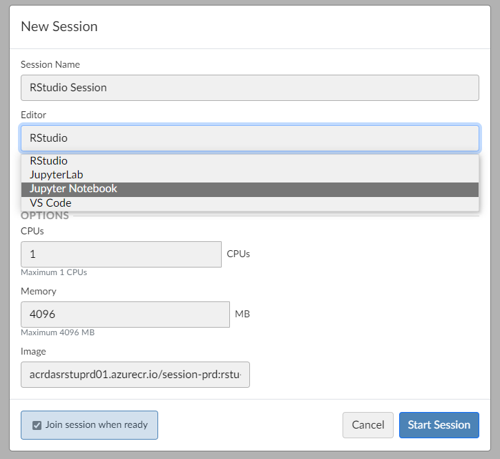
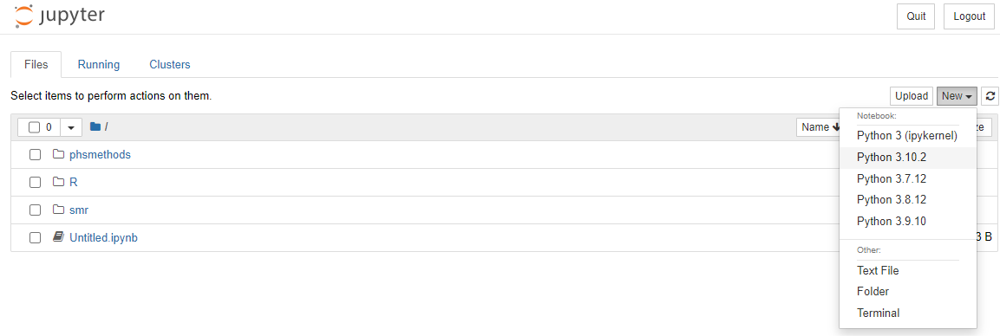
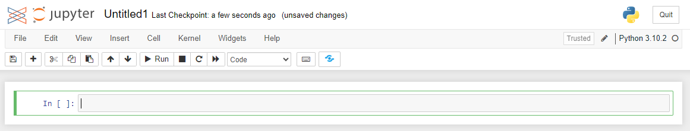
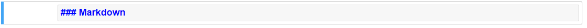
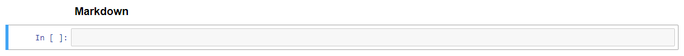

```{r setup, include=FALSE}
# Author: Tina Fu
# Original Date: February 2024
# Version of R: 4.3.2

# See here for learnr package documentation: https://rstudio.github.io/learnr/

# Include packages here that are required throughout the training
library(learnr)         # Required to build the Shiny app
# library(gradethis)      # Required for specific code checking and specific feedback
library(reticulate)

knitr::opts_chunk$set(echo = FALSE)

tutorial_options(
  exercise.checker = gradethis::grade_learnr
)
```

```{python pandas-setup, include = FALSE, eval = FALSE}
# Import pandas library
import pandas as pd 

borders2 = pd.read_csv("data/borders_inc_age.csv", usecols = ['URI', 'HospitalCode', 'Specialty']) 
```

```{r phs-logo, echo=FALSE, fig.align='right', out.width="40%"}
knitr::include_graphics("images/phs-logo.png")
```

## Introduction

Welcome to an introduction to python. This course is designed as a self-led introduction to R Markdown for anyone in Public Health Scotland.

<div class="info_box">
  <h4>Course Info</h4>
  <ul>
    <li>This course is built to flow through sections and build on previous knowledge. If you're comfortable with a particular section, you can skip it.</li>
    <li>Most sections have multiple parts to them. Navigate the course by using the buttons at the bottom of the screen to Continue or go to the Next Topic.</li>
    <li>The course will also show progress through sections, a green tick will appear on sections you've completed, and it will remember your place if you decide to close your browser and come back later.</li>
  </ul>
</div>
</br>

### What is Python?

Python is a powerful general purpose programming language with widespread use in many application domains. Python is open source and free to use, and available for all major operating systems.

### Jupyter Notebook

There are several environments where you can run Python codes, such as "JupyterLab", "Jupyter Notebook". In this training course, we will use “Jupyter Notebook”. 

Jupyter Notebook is designed for the easy integration of text and Python programming. It provides a more interactive workflow for Python programming, analysis and reporting. Some of its key features are:

- Code completion
- Syntax highlighting
- Code refactoring (find and replace)
- Integrated documentation viewer
- Ability to combine text, equations and images as well as code in a single document
- All outputs of the executed code are saved and embedded in the notebook
- Cell based execution and editing of code/text segments

#### Open a New Jupyter Notebook

We can access "Jupyter Notebook" on [Posit Workbench](https://pwb.publichealthscotland.org/). After signing in, click on New Session and a diaglog box will pop up. Click on Editor and select "Jupyter Notebook" from the drop down list, and then Start Session. 

```{r openpynb, fig.align='center', out.width="60%"}

```

</br>

You will see the interface looks like this. There are three main tabs in Jupyter on start-up:

- **Files** Your file directory
- **Running** Lists all of the notebooks currently running
- **Clusters** For using IPython in parallel with your cluster (beyond the scope of this training guidance)

```{r startsession, fig.align='center', out.width="100%"}
knitr::include_graphics("images/python-pwb-startsession.PNG")
```

</br>

To open a new Jupyter Notebook, click the "New" drop down menu on the Files tab and select “Python 3.10.2” under the notebooks heading. This will open a blank Notebook with an IPython console running underneath it. 

```{r newnb, fig.align='center', out.width="100%"}

```

```{r blanknb, fig.align='center', out.width="100%"}

```

</br>

The IPython console is used to input and execute Python code interactively. Outputs, errors and warning messages are directly shown in the same window. A command that has been entered into the console is executed by

- Pressing *Shift + Enter* to execute all the codes in the current active cell and advance the cursor to the next cell. Or press the “run cell, select below” button   on the toolbar. 

- Pressing *Ctrl + Enter* to execute all the codes in the current active cell. If you want to move to the next cell below, just simply click on the “insert cell below” button  on the toolbar.

#### Command and Edit Modes

Jupyter notebook is a modal editor which means that the keyboard does different things depending on which mode the Notebook is in. There are two modes: **edit mode** and **command mode**. 

- **Edit mode** - it is indicated by a green cell border and left sidebar, and a prompt showing in the editor area: 

```{r editmode, fig.align='center', out.width="100%"}

```

When a cell is in edit mode, you can type things such as Python codes into the cell, like a normal text editor. Enter edit mode by pressing Enter or using the mouse to click on a cell’s editor area. 

- **Command mode** - Once you click somewhere else outside the cell or press “esc” on keyboard, the cell turns into Command mode. Command mode is indicated by a grey cell border and a blue sidebar:

```{r commandmode, fig.align='center', out.width="100%"}

```

When you are in command mode, you are able to edit the notebook as a whole, but not type into individual cells. Most importantly, in command mode, the keyboard is mapped to a set of shortcuts that let you perform notebook and cell actions efficiently. For example, if you are in command mode and you press C and V, you will copy and paste the current cell.

A full list of useful shortcuts is available by going to "Help > Keyboard Shortcuts" (You can also access by pressing H in command mode).

#### Markdown Text Cells

Markdown text cells support plain text, Markdown and HTML. It will be useful to create headings, text instructions etc using markdown to organise the notebook like a written document. A cell can be changed from code mode to markdown mode by going to the top menu bar "Cell > Cell Type > Markdown". Or select “Markdown” from the dropdown list:

```{r markdown, fig.align='center', out.width="100%"}
knitr::include_graphics("images/markdown-menu.PNG")
```

Or press M while in Command Mode and highlighting the cell. 

Here is an example of typing some text in a markdown cell. You can use hash key “#” to indicate the size of heading, followed by a space and the text. 

```{r markdown-example1, fig.align='center', out.width="100%"}

```

Then press *Shift + Enter* to finish. 

```{r markdown-example2, fig.align='center', out.width="100%"}

```

#### Python Library

Python library is a collection of functions and methods that allows you to perform lots of actions without writing your own code. For example, “pandas” is a Python library for data manipulation and analysis, which is used a lot in this training guidance. 

## Foundations

This section will walk you through the key data types and structures necessary to hit the ground running and start using Python productively. 

### Numbers

There are 3 main types of numbers that can be declared in Python. 

```{python numbers, eval = FALSE, echo = TRUE}
age = 27 # Integers
height = 1.76 # Floating point numbers
k = 6.626e-32 # Using scientific notation
var1 = 2 + 5.2j # Complex numbers
```

### Arithmetic Operators

The following are examples of all the arithmetic operators available in Python. 

```{r, echo = FALSE}
operators_table <- data.frame(
  "Precedence" = c(1, 2, 3, 4), 
  "Operator" = c("`+` `-`", "`*` `**` `/`", "`//`", "`%`"), 
  "Description" = c("Addition, Subtraction", "Multiplication, Power, Division", "Floor Division (round down after division)", "Modulus (remainder after division)")
)

knitr::kable(operators_table)
```

### Strings

Strings in Python are an ordered sequence of characters, and can be declared with either single or double quotes. 

```{python strings1, eval = FALSE, echo = TRUE}
name = 'John'
surname = 'Doe'
```

Multiline strings can be declared with triple single and triple double quotes, but note that whitespace characters are recorded in the string e.g. for tabs and for newlines. 

```{python strings2, exercise = TRUE}
multiline = '''White space is
preserved
in multiline strings.'''

multiline
```

The `print()` function interprets these escape characters as expected. 

```{python strings3, exercise = TRUE}
print(multiline)
```

Different string quoting styles can be nested as only the outer one is used. You can also use a backslash to escape quote characters within the string if you need to display them. 

```{python string4, exercise = TRUE}
nested_quotes = 'It\'s sometimes "necessary" to escape things'
nested_quotes
print(nested_quotes)
```

For strings, the plus `+` sign will concatenate two strings into one, and the asterisk `*` will repeat a string a set number of times. Have a look and click 'Run Code' below to see the output. 

```{python string5, exercise = TRUE}
print('Hello' + ' ' + 'World')
print('Hello' + ' ' + 'World' * 4)
print('Hello' + (' ' + 'World') * 4)
```

### Data Types and Type Conversion

The `type()` function can be used to query the type of a Python object, and any type conversion can be performed by using the appropriate function e.g. `int()` for integer, `str()` for string, and `float()` for a floating point number. 

```{python type-conversion, exercise = TRUE}
myint = 12345
type(myint) # Check the data type of myint

mystr = str(myint) # Convert myint to a string
myfloat = float(myint) # Convert myint to a floating point number

mystr
myfloat
```

## Importing and Exporting Datasets

The Python language can be used for data analysis. The first step in performing analysis is to access your dataframe (i.e. your dataset). This section will introduce you how to import and export datasets. 

### Read and Save .csv Files

Various commonly used file formats can be read using Python, such as .csv and .xls files. You can import these files by using the “pandas” library. The general code is 

```{python csv-read, eval = FALSE, echo = TRUE}
dataset_name = pd.read_csv("filename.csv")
```

There are three pieces to this code:

- to the right of the `=` sign is the pandas import code:
`pd.read_csv("filename.csv")`
- to the left of the `=` sign is the name we've given to the dataset:
`dataset_name`
- the `=` sign tells Python to connect the name `dataset_name` to the imported dataset

This is an example of a more general concept in Python called **variable assignment**. A **variable** in Python is a name for referring to an object, just like `dataset_name` refers to the imported dataset. The object in question is called the **value** of the variable. 

To assign a value to a variable, we use the `=` sign as above:

```{python variable-assignment, eval = FALSE, echo = TRUE}
variable = value
```

**Also remember that Python is a case-sensitive language.**

Here is a real example for importing a dataset "borders_inc_age.csv". 
Have a look and click 'Run Code' below to see the output. 

```{python csv-read-example, exercise = TRUE}
# Import pandas library
import pandas as pd 
# Read in the dataset
borders = pd.read_csv("data/borders_inc_age.csv") 
# Check the first few rows of the dataset. Default is 5 rows. 
borders.head() 
```

If you make any changes to borders and would like to save it as a new .csv file, use the following command:

```{python csv-save, eval = FALSE, echo = TRUE}
borders.to_csv("file path and name")
```

### Read Specific Columns

It is possible to omit certain columns from a dataframe when importing a file by using **usecols** command:

```{python csv-read-columns1, exercise = TRUE, exercise.setup = "pandas-setup"}
# Read in the dataset with specific columns
borders2 = pd.read_csv("data/borders_inc_age.csv", usecols = ['URI', 'HospitalCode', 'Specialty']) 

# Check the first few rows of the dataset. Default is 5 rows. 
borders2.head() 
```

It is also possible to rearrange the columns within an imported dataframe. The columns in the example above can be rearranged using the following code:

```{python csv-read-columns2, exercise = TRUE, exercise.setup = "pandas-setup"}
# Rearrange the columns
borders3 = borders2[['URI', 'Specialty', 'HospitalCode']]

# Check the first few rows of the dataset. Default is 5 rows. 
borders3.head()
```

Once the dataframe has been read in, you can delete a specific column (or columns) that you do not need using **del** command:

```{python delete-column, exercise = TRUE, exercise.setup = "pandas-setup"}
# Delete URI column
del borders2["URI"]

# Check the first few rows of the dataset. Default is 5 rows. 
borders2.head()
```

### Knowledge Check

```{r example-quiz}
quiz(
  question("[Question]",
    answer("[Incorrect answer]", correct = FALSE),
    answer("[Incorrect answer with feedback]", correct = FALSE, message = "[Specific feedback.]"),
    answer("[Correct answer]", correct = TRUE),
    incorrect = "[General feedback for any incorrect answer.]",
    allow_retry = TRUE,
    random_answer_order = TRUE
  )
)
```

### Code Exercise

```{r example-code-q, exercise=TRUE}
# Hello World example
hello_world <- "Hello World"

print(hello_world)
```

## Explore

### Mean/Median & Summary

* `mean()` and `median()` are passed arrays of values (usually from a data frame) to return the mean and median value.

* `describe()` returns all summary statistics based on a given array.

In the exercise below, you have the borders data-set loaded as `borders_data`. See if you can get the mean value for `LengthOfStay`, store it in a variable, and print that variable. Use the hint button if you need some help.

```{python mean, exercise = TRUE, exercise.setup = "pandas-setup"}

borders_data = pd.read_csv("data/borders_inc_age.csv")

borders_data
```

```{python mean-hint-1}

borders_data = pd.read_csv("data/borders_inc_age.csv")

borders_data["LengthOfStay"]
```


```{python mean-hint-2}

borders_data = pd.read_csv("data/borders_inc_age.csv")

borders_data["LengthOfStay"].mean()
```


```{python mean-hint-3}

borders_data = pd.read_csv("data/borders_inc_age.csv")

mean_value = borders_data["LengthOfStay"].mean()

print(mean_value)
```

```{python mean-solution}

borders_data = pd.read_csv("data/borders_inc_age.csv")

mean_value = borders_data["LengthOfStay"].mean()

print(mean_value)
```

```{python mean-check}
grade_code()
```


### Frequencies & Crosstabs

* Frequency: `<df_name>["<col_name>").value_counts()]`
* Crosstab: `pd.crosstab(<df_name>["<col_1_name>"], <df_name>["<col_2_name>"])`
* Crosstab & Add Col/Row Totals: `pd.crosstab(<df_name>["<col_1_name>"], <df_name>["<col_2_name>"], margins = True)`
tab
Create a crosstab for `HospitalCode` and `Sex`, add column and row totals, store the table in a variable, and print it out. Use the hint button if you need some help.

```{python freq, exercise = TRUE, exercise.setup = "pandas-setup"}

borders_data = pd.read_csv("data/borders_inc_age.csv")


```

```{python freq-hint-1}

borders_data = pd.read_csv("data/borders_inc_age.csv")

...pd.crosstab(...)
```

```{python freq-hint-2}

borders_data = pd.read_csv("data/borders_inc_age.csv")

crosstab_hospitalcode_sex = pd.crosstab(
  borders_data["HospitalCode"], borders_data["Sex"]...)
```

```{python freq-hint-3}

borders_data = pd.read_csv("data/borders_inc_age.csv")

crosstab_hospitalcode_sex = pd.crosstab(
  borders_data["HospitalCode"], borders_data["Sex"], margins = True)
print(crosstab_hospitalcode_sex)
```

```{python freq-solution}

borders_data = pd.read_csv("data/borders_inc_age.csv")

crosstab_hospitalcode_sex = pd.crosstab(
  borders_data["HospitalCode"], borders_data["Sex"], margins = True)

print(crosstab_hospitalcode_sex)
```

```{python freq-check}
grade_code()
```

## Wrangle – Part 1

For the next sections, we will focus on using the pandas module manipulate data and data frames.


### Location

There are multiple ways to wrangle data in Python - some are more straightforward than others.

To begin efficiently locating and manipulating data, it would be beneficial to become familiar with the concept of locating data in a dataframe.

The `loc` and `iloc` attributes are used for indexing, which allows for the locating of data from a dataframe based on row and column labels/indexes.

`loc` - Label-based indexing (such as Hospital Codes, Names, etc.). </br>
`iloc` - Integer-based indexing (remember Python indexes count from 0).

By default, `loc` and `iloc` locates row indexes, instead of column indexes.

`<df_name>.loc['<row_label>']` will select the first row with row_label as the label index.</br>
`<df_name>.iloc['<row_index_label>']` will select the row at index == row_index_label.


This does not mean the location attributes are isolated to only locating rows - in fact, the real power of the location attributes is in its ability to freely locate relevant rows, columns, values, etc.

It would further be helpful to remember that in some methods, the `axis` stated will indicate whether it is targetting a row or a column.

`axis = 0` = row </br>
`axis = 1` = column

In the next few sections, we will see how useful the location attributes can be.


### Select / Slice Out Columns

By far, the most straightforward way to select a column is by the following method:

* Selecting/Slicing Out a column: `<df_name>["<col_name>"]`

However, by using `loc` and `iloc`, we can start to specify further:

* Selecting/Slicing Out a column: `<df_name>.loc["<row_index>","<column_index>"]`

* Example: `borders_data.loc[:,"Specialty"]` will obtain all the rows from the `Specialty` column.

You may be wondering why using the `loc` attribute is helpful here when the first method is much more simple.

Using `loc`, you have the ability to select specific rows within that column

* Example: `borders_data.loc[0:2,"HospitalCode"]` will obtain the first 3 rows from the `HospitalCode` column.

Read in the data stored in the borders_inc_age csv file, select/slice out the entire `HospitalCode` column using pandas, and print out the selected column.

```{python select, exercise = TRUE, exercise.setup = "pandas-setup"}

borders_data = pd.read_csv("data/borders_inc_age.csv")

column_hospital_code = 

```

```{python select-hint-1}

borders_data = pd.read_csv("data/borders_inc_age.csv")

column_hospital_code = borders_data.loc
```

```{python select-hint-2}

borders_data = pd.read_csv("data/borders_inc_age.csv")

column_hospital_code = borders_data.loc[:,]
```

```{python select-hint-3}

borders_data = pd.read_csv("data/borders_inc_age.csv")

column_hospital_code = borders_data.loc[:,'HospitalCode']

print(column_hospital_code)
```

```{python select-solution}

borders_data = pd.read_csv("data/borders_inc_age.csv")

column_hospital_code = borders_data.loc[:,'HospitalCode']

print(column_hospital_code)
```

```{python select-check}
grade_code()
```


### Select Rows

The pandas library has multiple way to select rows, depending on your criteria.

* Select Rows by index: `<df_name>.iloc[<index_number>]']`
* Example: `borders_data.iloc[0]` *This will show the first row of the dataframe *

* Select Rows which have a specific value in a specific column: `<df_name>[<df_name>['<column_name>'] == '<row_label>']`
* Example: `borders_data[borders_data['HospitalCode'] == 'B120H']` *This will show all the rows which have `B120H` in the `HospitalCode` column *

* Select Rows by index: `<df_name>.loc['<row_label>']']`
* Example: `borders_data.loc['row_label']` *This will locate the first instance of the row with row_label as the label index - please note, this csv file does not have row labels*

Read in the borders_inc_age csv file, and select all the rows with `Specialty == A1`.

```{python select-row, exercise = TRUE, exercise.setup = "pandas-setup"}

borders_data = pd.read_csv("data/borders_inc_age.csv")


```

```{python select-row-hint-1}

borders_data = pd.read_csv("data/borders_inc_age.csv")

rows_of_a1 = borders_data[...]
```

```{python select-row-hint-2}

borders_data = pd.read_csv("data/borders_inc_age.csv")

rows_of_a1 = borders_data[borders_data['...']...]
```

```{python select-row-hint-3}

borders_data = pd.read_csv("data/borders_inc_age.csv")

rows_of_a1 = borders_data[borders_data['Specialty']=='A1']
```

```{python select-row-solution}

borders_data = pd.read_csv("data/borders_inc_age.csv")

rows_of_a1 = borders_data[borders_data['Specialty']=='A1']
```

```{python select-row-check}
grade_code()
```

### Add a New Row/Column

Adding a new row/column is straightforward.

When adding a new row, you can first create a dictionary, where `keys` (column names) and `values` (corresponding values in the new row) are mapped together.

* Create dictionary of mapped keys (columns) and values (row values): 
`new_row_data = {'<column_name>':'<row_value>','<column_name>':'<row_value>','<column_name>':'<row_value>'}`

Then, you can append the new row into the dataframe.

* `<df_name> = <df_name>.append(new_row_data)`

If you want to leave the value blank, you can input `None` into the row_value.


* Add new column: `<df_name>['<new_column_name>'] = <row_value>`

This will create a new column with all the rows populated by the row_value.


Read in the borders_inc_age file. Create a new column called `number_of_eyebrows` with the row_value as `2` for all the rows.

```{python new-row, exercise = TRUE, exercise.setup = "pandas-setup"}

borders_data = pd.read_csv("data/borders_inc_age.csv")


```

```{python new-row-hint-1}

borders_data = pd.read_csv("data/borders_inc_age.csv")

borders_data[...] ...
```

```{python new-row-hint-2}

borders_data = pd.read_csv("data/borders_inc_age.csv")

borders_data['number_of_eyebrows'] = ....
```

```{python new-row-hint-3}

borders_data = pd.read_csv("data/borders_inc_age.csv")

borders_data['number_of_eyebrows'] = 2
```

```{python new-row-solution}

borders_data = pd.read_csv("data/borders_inc_age.csv")

borders_data['number_of_eyebrows'] = 2
```

```{python new-row-check}
grade_code()
```

### Delete a Row/Columns

There are multiple ways to delete rows and columns. 

When deleting a row, you could create a dataframe with the rows containing certain row_values filtered out:

* Deleting a row: `<df_name> = <df_name>[<df_name>['<column_name>'] != '<row_value>']`

You can also delete rows based on their index and row_label by slicing the locations.

* Removing the first row: `<df_name> = <df_name>.iloc[1:]` 

If we want to remove only the 2nd row using the same method, you would need to using locate the specific rows you want to keep, and append them together. 

* Removing the second row: `<df_name> = <df_name>.iloc[:1].append(<df_name>.iloc[2:]`

Alternatively, you could use the `drop()` method.

* Removing the second row: `<df_name> = <df_name>.drop(<df_name>.index[1])`

* Removing the second row row_label: `<df_name> = <df_name>.drop('<row_label>', axis=0)` **`axis=0` specifies you are removing a row.**

* Removing the second row by index position: `<df_name> = <df_name>.drop(index_position, axis=0)`

The `drop()` method can also be used to drop columns.

* Removing a column by label: `<df_name> = <df_name>.drop('<column_name>', axis=1)` **`axis=1` specifies you are removing a column.**

* Removing a column by index position: `<df_name> = <df_name>.drop(<df_name>.columns[index_position], axis=1)` 


Read in the borders_inc_age csv. Remove all the rows which have `Male` as the value in the `Sex` column.

```{python delete-row, exercise = TRUE, exercise.setup = "pandas-setup"}

borders_data = pd.read_csv("data/borders_inc_age.csv")


```

```{python delete-row-hint-1}

borders_data = pd.read_csv("data/borders_inc_age.csv")

borders_data = ...
```

```{python delete-row-hint-2}

borders_data = pd.read_csv("data/borders_inc_age.csv")

borders_data = borders_data[...]
```

```{python delete-row-hint-3}

borders_data = pd.read_csv("data/borders_inc_age.csv")

borders_data = borders_data[borders_data[...] != ...]
```

```{python delete-row-solution}

borders_data = pd.read_csv("data/borders_inc_age.csv")

borders_data = borders_data[borders_data['Sex'] != 'Male']
```

```{python delete-row-check}
grade_code()
```


## Wrangle – Part 2

### Manipulate Strings

There are a number of ways to manipulate strings in Python. Here are a few methods to achieve various outputs:

* Split values at a delimiter: `<df_name>['<column_name>'] = <df_name>['<column_name>'].str.split('<delimiter>')`

* Example: `borders_data['ManagementofPatient'] = borders_data['ManagementofPatient'].str.split('a')`

After the above line of code, if you `print(borders_data)`, you will see that all the values in the column `ManagementofPatient` has been split at the value 'a'.

* Strip values of leading and trailing white space: `<df_name>['<column_name>'] = <df_name>['<column_name>'].str.strip()`
* Convert values to upper case: `<df_name>['<column_name>'] = <df_name>['<column_name>'].str.upper()`
* Convert values to lower case: `<df_name>['<column_name>'] = <df_name>['<column_name>'].str.lower()`
* Replace values: `<df_name>['<column_name>'] = <df_name>['<column_name>'].str.replace('<old_value>','<new_value>')`

It is important to note that this is not an exhaustive list of all the string manipulation methods - there are many more to find out and use, depending on your specification requirements.

In the exercise below, read the borders_inc_age csv in, then replace all instances of `B120H` in the `HospitalCode` column with the phrase `BRILLIANT`.

```{python manipulate-string, exercise = TRUE, exercise.setup = "pandas-setup"}

borders_data = pd.read_csv("data/borders_inc_age.csv")


```

```{python manipulate-string-hint-1}

borders_data = pd.read_csv("data/borders_inc_age.csv")

borders_data['HospitalCode'] = ...
```

```{python manipulate-string-hint-2}

borders_data = pd.read_csv("data/borders_inc_age.csv")


borders_data['HospitalCode'] = borders_data['HospitalCode']...
```

```{python manipulate-string-hint-3}

borders_data = pd.read_csv("data/borders_inc_age.csv")


borders_data['HospitalCode'] = borders_data['HospitalCode'].str.replace('B120H','BRILLIANT')
```

```{python manipulate-string-solution}

borders_data = pd.read_csv("data/borders_inc_age.csv")

borders_data['HospitalCode'] = borders_data['HospitalCode'].str.replace('B120H','BRILLIANT')
```

```{python manipulate-string-check}
grade_code()
```

### Group By

The `groupby()` function in Pandas allows us to split a Dataframe into group based on one or more keys, such as column values, and then perform operations on them, such as aggregations or transformations.

* `<dataframe>.groupby('<column_name>')`

Read in the `borders_inc_age` csv. Then, apply the `groupby()` function to the `HospitalCode` column.

```{python groupby, exercise = TRUE, exercise.setup = "pandas-setup"}

borders_data = pd.read_csv("data/borders_inc_age.csv")


```

```{python groupby-hint-1}

borders_data = pd.read_csv("data/borders_inc_age.csv")

borders_data.groupby('HospitalCode')
```

```{python groupby-check}
grade_code()
```


### Aggregate Dataframe

With the `groupby()` function, we can apply the aggregate `agg()` function in conduct operations on specific columns.

* `<grouped_variable>.agg({<'column'> : <'function'>})`

Multiple operations can also be carried out.

* `<grouped_variable>.agg({<'column'> : [<'function1'>, <'function2'>,<'function3'>]})`

Multiple columns can aggregated.

* `<grouped_variable>.agg({<'column1'> : [<'function1'>, <'function2'>,<'function3'>],<'column2'> : [<'function1'>, <'function2'>,<'function3'>]})`

For example, let's store the above `borders_data.groupby('HospitalCode')` into a variable called `grouped_by_hospital_code`. 

We can now find the `mean`, `max`, `count` and `sum` of the `LengthOfStay` variables, grouped by `HospitalCode`.

* `grouped_by_hospital_code.agg({'LengthOfStay': ['mean','max','count','sum']})`

We could also more easily use the `describe()` function within the `agg()` function detailed above.

Give that a go: Read in the `borders_inc_age` csv file, then group by `HospitalCode`, storing that into a variable called `grouped_by_hospital_code`. Aggregate using the method above. Use the `describe()` function to find important values from the `LengthOfStay` column. 

```{python aggregate, exercise = TRUE, exercise.setup = "pandas-setup"}

borders_data = pd.read_csv("data/borders_inc_age.csv")


```

```{python aggregate-hint-1}

borders_data = pd.read_csv("data/borders_inc_age.csv")

group_by_hospital_code = borders_data.groupby('HospitalCode')

...
```

```{python aggregate-hint-2}

borders_data = pd.read_csv("data/borders_inc_age.csv")

group_by_hospital_code = borders_data.groupby('HospitalCode')

group_by_hospital_code.agg(
  ...)
```

```{python aggregate-hint-3}

borders_data = pd.read_csv("data/borders_inc_age.csv")

group_by_hospital_code = borders_data.groupby('HospitalCode')

group_by_hospital_code.agg(
  {'LengthOfStay':'describe'})

```

```{python aggregate-solution}

borders_data = pd.read_csv("data/borders_inc_age.csv")

group_by_hospital_code = borders_data.groupby('HospitalCode')

group_by_hospital_code.agg(
  {'LengthOfStay':'describe'})

```

```{python aggregate-check}
grade_code()
```


### Merge Dataframe


```{r join-diagrams-overview, echo=FALSE, fig.align='center', out.width="100%"}

```


## Help & Feedback

#### Feedback

[Insert iframe for Google/Microsoft Forms]

