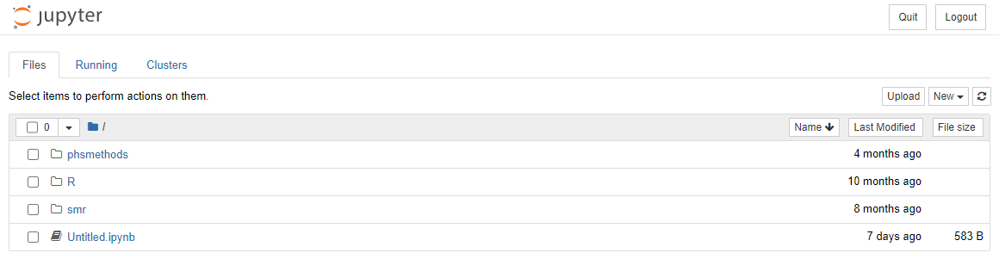

```{r setup, include=FALSE}
# Author: Tina Fu
# Original Date: February 2024
# Version of R: 4.3.2

# See here for learnr package documentation: https://rstudio.github.io/learnr/

# Include packages here that are required throughout the training

#install.packages("learnr")
library(learnr)         # Required to build the Shiny app
#install.packages("gradethis")
library(gradethis)      # Required for specific code checking and specific feedback
#install.packages("reticulate")
library(reticulate)

knitr::opts_chunk$set(echo = FALSE)

tutorial_options(
  exercise.checker = gradethis::grade_learnr
)
```


```{python pandas-setup, include = FALSE, eval = TRUE}
# Import pandas library
import pandas as pd 

borders = pd.read_csv("data/borders_inc_age.csv")

borders2 = pd.read_csv("data/borders_inc_age.csv", usecols = ['URI', 'HospitalCode', 'Specialty']) 
```

```{r phs-logo, echo=FALSE, fig.align='right', out.width="40%"}
knitr::include_graphics("images/phs-logo.png")
```

## Introduction

Welcome to an introduction to python. This course is designed as a self-led introduction to R Markdown for anyone in Public Health Scotland.

<div class="info_box">
  <h4>Course Info</h4>
  <ul>
    <li>This course is built to flow through sections and build on previous knowledge. If you're comfortable with a particular section, you can skip it.</li>
    <li>Most sections have multiple parts to them. Navigate the course by using the buttons at the bottom of the screen to Continue or go to the Next Topic.</li>
    <li>The course will also show progress through sections, a green tick will appear on sections you've completed, and it will remember your place if you decide to close your browser and come back later.</li>
  </ul>
</div>
</br>

### What is Python?

Python is a powerful general purpose programming language with widespread use in many application domains. Python is open source and free to use, and available for all major operating systems.

### How does Python run?

Traditionally, when a Python script is run, the entire script is interpreted and run from the top down. 

```{python runtime, eval = FALSE, echo = TRUE}
a = 15
b = 10
c = a + b 
print(c)
```

When the above Python script is run, the entire script will be run from the top down, resulting in an output of `25`.

There are a number of advantages to having Python scripts run this way. To name a few:

* The script has a sequential flow
* It is easier to debug
* It is clearer and more readable

However, there are a number of ways to run individual lines of code within a Python script, should that be preferred. In this course, we will touch upon `Jupyter Notebook` in the *IDE* section, where this can be accomplished. 


## IDE

### Jupyter Notebook

There are several environments where you can run Python codes, such as "JupyterLab", "Jupyter Notebook". In this training course, we will use “Jupyter Notebook”. 

Jupyter Notebook is designed for the easy integration of text and Python programming. It provides a more interactive workflow for Python programming, analysis and reporting. Some of its key features are:

- Code completion
- Syntax highlighting
- Code refactoring (find and replace)
- Integrated documentation viewer
- Ability to combine text, equations and images as well as code in a single document
- All outputs of the executed code are saved and embedded in the notebook
- Cell based execution and editing of code/text segments

#### Open a New Jupyter Notebook

We can access "Jupyter Notebook" on [Posit Workbench](https://pwb.publichealthscotland.org/). After signing in, click on New Session and a diaglog box will pop up. Click on Editor and select "Jupyter Notebook" from the drop down list, and then Start Session. 

```{r openpynb, fig.align='center', out.width="60%"}

```

</br>

You will see the interface looks like this. There are three main tabs in Jupyter on start-up:

- **Files** Your file directory
- **Running** Lists all of the notebooks currently running
- **Clusters** For using IPython in parallel with your cluster (beyond the scope of this training guidance)

```{r startsession, fig.align='center', out.width="100%"}

```

</br>

To open a new Jupyter Notebook, click the "New" drop down menu on the Files tab and select “Python 3.10.2” under the notebooks heading. This will open a blank Notebook with an IPython console running underneath it. 

```{r newnb, fig.align='center', out.width="100%"}
knitr::include_graphics("images/python-pwb-newnb.png")
```

```{r blanknb, fig.align='center', out.width="100%"}

```

</br>

The IPython console is used to input and execute Python code interactively. Outputs, errors and warning messages are directly shown in the same window. A command that has been entered into the console is executed by

- Pressing *Shift + Enter* to execute all the codes in the current active cell and advance the cursor to the next cell. Or press the “run cell, select below” button   on the toolbar. 

- Pressing *Ctrl + Enter* to execute all the codes in the current active cell. If you want to move to the next cell below, just simply click on the “insert cell below” button  on the toolbar.

#### Command and Edit Modes

Jupyter notebook is a modal editor which means that the keyboard does different things depending on which mode the Notebook is in. There are two modes: **edit mode** and **command mode**. 

- **Edit mode** - it is indicated by a green cell border and left sidebar, and a prompt showing in the editor area: 

```{r editmode, fig.align='center', out.width="100%"}
knitr::include_graphics("images/edit-mode.PNG")
```

When a cell is in edit mode, you can type things such as Python codes into the cell, like a normal text editor. Enter edit mode by pressing Enter or using the mouse to click on a cell’s editor area. 

- **Command mode** - Once you click somewhere else outside the cell or press “esc” on keyboard, the cell turns into Command mode. Command mode is indicated by a grey cell border and a blue sidebar:

```{r commandmode, fig.align='center', out.width="100%"}

```

When you are in command mode, you are able to edit the notebook as a whole, but not type into individual cells. Most importantly, in command mode, the keyboard is mapped to a set of shortcuts that let you perform notebook and cell actions efficiently. For example, if you are in command mode and you press C and V, you will copy and paste the current cell.

A full list of useful shortcuts is available by going to "Help > Keyboard Shortcuts" (You can also access by pressing H in command mode).

#### Markdown Text Cells

Markdown text cells support plain text, Markdown and HTML. It will be useful to create headings, text instructions etc using markdown to organise the notebook like a written document. A cell can be changed from code mode to markdown mode by going to the top menu bar "Cell > Cell Type > Markdown". Or select “Markdown” from the dropdown list:

```{r markdown, fig.align='center', out.width="100%"}
knitr::include_graphics("images/markdown-menu.PNG")
```

Or press M while in Command Mode and highlighting the cell. 

Here is an example of typing some text in a markdown cell. You can use hash key “#” to indicate the size of heading, followed by a space and the text. 

```{r markdown-example1, fig.align='center', out.width="100%"}
knitr::include_graphics("images/markdown-example1.PNG")
```

Then press *Shift + Enter* to finish. 

```{r markdown-example2, fig.align='center', out.width="100%"}
knitr::include_graphics("images/markdown-example2.PNG")
```

#### Python Library

Python library is a collection of functions and methods that allows you to perform lots of actions without writing your own code. For example, “pandas” is a Python library for data manipulation and analysis, which is used a lot in this training guidance. 

## Foundations

This section will walk you through some of the foundational knowledge of Python, including structure, style, and key data types.

### Structure

**Indentation** - where indentation in other programming languages are included as a style preference, indentation in Python is extremely important, as it indicates what blocks of code should be run. 

Without proper indentations, your code will not run. Try to run the following code with improper indentation:

```{python indentation1, exercise = TRUE}
if 1 < 10:
print("One is less than ten.")
```

Note the syntax error which was shown:

Now run the code with the proper indentation:

```{python indentation2, exercise = TRUE}
if 1 < 10:
  print("One is less than ten.")
```

Indentation not only affords proper functionality, but it also enhances readability and comprehension for yourself, and future co-developers. 

### Style

**Naming** - variables and filenames should have meaningful names in *`snake_case`* format, preferring all lower case.

<div>
```{r echo=FALSE, fig.align='center', out.width="100%"}
knitr::include_graphics("images/r_coding_cases.png")
```
</div>

### Numbers

There are 3 main types of numbers that can be declared in Python. 

```{python numbers, eval = FALSE, echo = TRUE}
age = 27 # Integers
height = 1.76 # Floating point numbers
k = 6.626e-32 # Using scientific notation
var1 = 2 + 5.2j # Complex numbers
```

### Arithmetic Operators

The following are examples of all the arithmetic operators available in Python. 

```{r, echo = FALSE}
operators_table <- data.frame(
  "Precedence" = c(1, 2, 3, 4), 
  "Operator" = c("`+` `-`", "`*` `**` `/`", "`//`", "`%`"), 
  "Description" = c("Addition, Subtraction", "Multiplication, Power, Division", "Floor Division (round down after division)", "Modulus (remainder after division)")
)

knitr::kable(operators_table)
```

### Strings

Strings in Python are an ordered sequence of characters, and can be declared with either single or double quotes. 

```{python strings1, eval = FALSE, echo = TRUE}
name = 'John'
surname = 'Doe'
```

Multiline strings can be declared with triple single and triple double quotes, but note that whitespace characters are recorded in the string e.g. for tabs and for newlines. 

```{python strings2, exercise = TRUE}
multiline = '''White space is
preserved
in multiline strings.'''

multiline
```

The `print()` function interprets these escape characters as expected. 

```{python strings3, exercise = TRUE}
print(multiline)
```

Different string quoting styles can be nested as only the outer one is used. You can also use a backslash to escape quote characters within the string if you need to display them. 

```{python string4, exercise = TRUE}
nested_quotes = 'It\'s sometimes "necessary" to escape things'
nested_quotes
print(nested_quotes)
```

For strings, the plus `+` sign will concatenate two strings into one, and the asterisk `*` will repeat a string a set number of times. Have a look and click 'Run Code' below to see the output. 

```{python string5, exercise = TRUE}
print('Hello' + ' ' + 'World')
print('Hello' + ' ' + 'World' * 4)
print('Hello' + (' ' + 'World') * 4)
```

### Boolean

Booleans represent either `True` or `False`.

When Python code is run, expressions can be compared and a Boolean answer can be returned:

```{python boolean1, exercise = TRUE}
print(5 == 5)
print(10 == 2)
print(5 < 4)
```

If a value has some sort of content, it is normally evaluated as true:

```{python boolean2, exercise = TRUE}
bool("Hi")
bool([])
```

Note that the empty `list` in the second expression returned `False`.

### Data Types and Type Conversion

The `type()` function can be used to query the type of a Python object, and any type conversion can be performed by using the appropriate function e.g. `int()` for integer, `str()` for string, and `float()` for a floating point number. 

```{python type-conversion, exercise = TRUE}
myint = 12345
type(myint) # Check the data type of myint

mystr = str(myint) # Convert myint to a string
myfloat = float(myint) # Convert myint to a floating point number

mystr
myfloat
```

## Data Structures

There are various data structures which are built into Python. Some of the main ones are:

#### Lists

- Lists are ordered collections of items.
- They are mutable, meaning you can add, remove, or modify elements.
- Lists can contain elements of different data types.

```{python list, exercise = TRUE}
my_list = [1, 2, 'apple', 'banana']
print(my_list)
```

#### Tuples

- Tuples are ordered collections of items, similar to lists.
- Tuples are immutable - once they are created, the elements cannot be changed.
- Tuples can contains elements of different data types.

```{python tuples, exercise = TRUE}
my_tuple = (1, 2, 'apple', 'banana')
print(my_tuple)
```

#### Dictionaries

- Dictionaries are unordered collections of key-value pairs.
- They are mutable, and each key within a dictionary must be unique.
- Dictionaries are used when you need to associate some data (value) with a specific identifier (key).


```{python dictionaries, exercise = TRUE}
my_dict = {'name': 'John', 'age': 30, 'city': 'New York'}
print(my_dict)
```

You can then retrieve associate values as such:

```{python dictionaries2, exercise = TRUE}
my_dict = {'name': 'John', 'age': 30, 'city': 'New York'}

name_value = my_dict['name']
print(name_value)
```

#### Set

- Sets are unordered collections of unique items.
- They are mutable, but their elements must be immutable.
- Sets are useful for operations like finding intersections, unions, and differences between collections.

```{python sets, exercise = TRUE}
my_set = {1, 2, 3, 4, 5}
print(my_set)
```

#### Strings

- Strings are sequences of characters.
- They are immutable, meaning you cannot change the characters in a string once it's created.
- Strings support various operations and methods for text manipulation.


```{python stringexample, exercise = TRUE}
my_string = 'Hello, World!'
print(my_string)
```

## Functions

In Python, functions are a block of organised and reusable code which performs a specific task.

Functions can be called from anywhere within the script, and can be stored anywhere within the script - **however**, it is custom convention to store functions are the top, or near the top, of the script in order to enhance readability and maintenance of the code. 

### Structure

Functions are made up of the:

* Defined keyword `def`
* Function name
* `()` parentheses which may include parameters.
* Function body


```{python function1, eval = FALSE, echo = TRUE}
def <function_name>():
  function_body

```

Example:


```{python function2, exercise=TRUE}
def greet():
  print("Hello!")
```

When you run the above code, you will see that nothing is outputted - this is because the function has not been called.


```{python function3, exercise=TRUE}
def greet():
  print("Hello!")

greet()
```

### Parameters and Arguments

Parameters are variables which are listed inside the parentheses in the function definition.

They are placeholders are actual values which will be passed into the function when it is called.

The values passed into a function are called arguments. 


```{python function4, exercise=TRUE}
def greet(name):
  print("Hello, " + name + "!")
  
greet("Bob")
```

You can also pass through multiple arguments:


```{python function5, exercise=TRUE}
def add(a,b,c):
  print(a + b + c)
  
result = add(1,2,3)
```

### Return

The return statement can optionally be used to return the data back to the caller.

```{python function6, exercise=TRUE}
def add(a,b,c):
  return a + b + c
  
result = add(1,2,3)
print(result)
```


## Control Flow & Iteration{#comparisonoperators}

As is the case in most other programming languages, control flow is where decisions are made, and iteration is where processes are repeated. 

### Comparison Operators

Here are the most commonly used comparison operators used in conditional statements in Python:

```{r, echo = FALSE}
operators_table <- data.frame(
  "Operator" = c("`>` `<`", "`==` `!=`", "`<=` `>=`","`and` `or`"), 
  "Description" = c("Greater than, Less than", "Equal to, Not Equal to", "Less than or equal to, Greater than or equal to", "And, Or")
)

knitr::kable(operators_table)
```


### Control Flow - If

`if` is the most common comparison operator used in Python.

```{python if1, exercise=TRUE}
if 5 == 5:
  print("5 is equal to 5")

if 5 == 4 or 5 == 5:
  print("Either 5 is equal to 4, or 5 is equal to 5")

if 6 <= 6:
  print("6 is less than or equal to 6")
```

There are some further statements when using `if` that you should be familiar with:

- `elif` is short for *else if* and is used for multiple `if` conditions
- `else` is executed if the preceding `if` and `elif` statements are false


```{python if2, exercise=TRUE}
def check_if_number_is_1_2_or_3(number):
  if number == 1:
    print("The number is 1")
  elif number == 2:
    print("The number is 2")
  else:
    print("The number is 3")

check_if_number_is_1_2_or_3(3)
```

### For loop

For loops are used for iteration.

There are multiple ways to use for loops.

#### Iterating over a list:


```{python forloop1, exercise=TRUE}
list_of_fruits = ["apple","banana","cherry"]

for fruits in list_of_fruits:
  print(fruits)
```

#### Using Enumerate:

You can also use `enumerate` to iterate over a sequence and get the index position of each item also:

```{python forloop2, exercise=TRUE}
list_of_fruits = ["apple","banana","cherry"]

for index, fruits in enumerate(list_of_fruits):
  print(index,fruits)
```


#### Iterating over a string:


```{python forloop3, exercise=TRUE}
for char in "Python":
    print(char)
```

#### Iterating over a range:

`range` in Python determines the position of the value, rather than the value itself. 

Remember that positions in Python begin at position `0`.

```{python forloop4, exercise=TRUE}

for i in range(5):
    print(i)

```

#### Nested Loops

```{python forloop5, exercise=TRUE}

adjective = ["red", "big", "tasty"]
fruits = ["apple", "banana", "cherry"]

for x in adjective:
    for y in fruits:
        print(x, y)

```


## Importing and Exporting Datasets

The Python language can be used for data analysis. The first step in performing analysis is to access your dataframe (i.e. your dataset). This section will introduce you how to import and export datasets. 

### Read and Save .csv Files

Various commonly used file formats can be read using Python, such as .csv and .xls files. You can import these files by using the “pandas” library. The general code is 

```{python csv-read, eval = FALSE, echo = TRUE}
dataset_name = pd.read_csv("filename.csv")
```

There are three pieces to this code:

- to the right of the `=` sign is the pandas import code:
`pd.read_csv("filename.csv")`
- to the left of the `=` sign is the name we've given to the dataset:
`dataset_name`
- the `=` sign tells Python to connect the name `dataset_name` to the imported dataset

This is an example of a more general concept in Python called **variable assignment**. A **variable** in Python is a name for referring to an object, just like `dataset_name` refers to the imported dataset. The object in question is called the **value** of the variable. 

To assign a value to a variable, we use the `=` sign as above:

```{python variable-assignment, eval = FALSE, echo = TRUE}
variable = value
```

**Also remember that Python is a case-sensitive language.**

Here is a real example for importing a dataset "borders_inc_age.csv". 
Have a look and click 'Run Code' below to see the output. 

```{python csv-read-example, exercise = TRUE}
# Import pandas library
import pandas as pd 
# Read in the dataset
borders = pd.read_csv("data/borders_inc_age.csv") 
# Check the first few rows of the dataset. Default is 5 rows. 
borders.head() 
```

If you make any changes to borders and would like to save it as a new .csv file, use the following command:

```{python csv-save, eval = FALSE, echo = TRUE}
borders.to_csv("file path and name")
```

### Read Specific Columns

It is possible to omit certain columns from a dataframe when importing a file by using **usecols** command:

```{python csv-read-columns1, exercise = TRUE, exercise.setup = "pandas-setup"}
# Read in the dataset with specific columns
borders2 = pd.read_csv("data/borders_inc_age.csv", usecols = ['URI', 'HospitalCode', 'Specialty']) 

# Check the first few rows of the dataset. Default is 5 rows. 
borders2.head() 
```

It is also possible to rearrange the columns within an imported dataframe. The columns in the example above can be rearranged using the following code:

```{python csv-read-columns2, exercise = TRUE, exercise.setup = "pandas-setup"}
# Rearrange the columns
borders3 = borders2[['URI', 'Specialty', 'HospitalCode']]

# Check the first few rows of the dataset. Default is 5 rows. 
borders3.head()
```

Once the dataframe has been read in, you can delete a specific column (or columns) that you do not need using **del** command:

```{python delete-column, exercise = TRUE, exercise.setup = "pandas-setup"}
# Delete URI column
del borders2["URI"]

# Check the first few rows of the dataset. Default is 5 rows. 
borders2.head()
```

### Knowledge Check

```{r example-quiz}
quiz(
  question("[Question]",
    answer("[Incorrect answer]", correct = FALSE),
    answer("[Incorrect answer with feedback]", correct = FALSE, message = "[Specific feedback.]"),
    answer("[Correct answer]", correct = TRUE),
    incorrect = "[General feedback for any incorrect answer.]",
    allow_retry = TRUE,
    random_answer_order = TRUE
  )
)
```

### Code Exercise

```{r example-code-q, exercise=TRUE}
# Hello World example
hello_world <- "Hello World"

print(hello_world)
```


## Explore

### Mean/Median & Summary

* `mean()` and `median()` are passed arrays of values (usually from a data frame) to return the mean and median value.

* `describe()` returns all summary statistics based on a given array.

For example, `<df_name>["<col_name>"].median()` will generate the `median` value of the values within the stated column.

In the exercise below, you have the borders data-set loaded as `borders_data`. See if you can get the mean value for `LengthOfStay`, store it in a variable, and print that variable. Use the hint button if you need some help.

```{python mean, exercise = TRUE, exercise.setup = "pandas-setup"}

borders_data = pd.read_csv("data/borders_inc_age.csv")

borders_data
```

```{python mean-hint-1}

borders_data = pd.read_csv("data/borders_inc_age.csv")

borders_data["LengthOfStay"]
```


```{python mean-hint-2}

borders_data = pd.read_csv("data/borders_inc_age.csv")

borders_data["LengthOfStay"].mean()
```


```{python mean-hint-3}

borders_data = pd.read_csv("data/borders_inc_age.csv")

mean_value = borders_data["LengthOfStay"].mean()

print(mean_value)
```

```{python mean-solution}

borders_data = pd.read_csv("data/borders_inc_age.csv")

mean_value = borders_data["LengthOfStay"].mean()

print(mean_value)
```

```{python mean-check}
grade_code()
```


### Frequencies & Crosstabs

* Frequency: `<df_name>["<col_name>").value_counts()]`
* Crosstab: `pd.crosstab(<df_name>["<col_1_name>"], <df_name>["<col_2_name>"])`
* Crosstab & Add Col/Row Totals: `pd.crosstab(<df_name>["<col_1_name>"], <df_name>["<col_2_name>"], margins = True)`
tab

Create a crosstab for `HospitalCode` and `Sex`, add column and row totals, store the table in a variable, and print it out. Use the hint button if you need some help.

```{python freq, exercise = TRUE, exercise.setup = "pandas-setup"}

borders_data = pd.read_csv("data/borders_inc_age.csv")


```

```{python freq-hint-1}

borders_data = pd.read_csv("data/borders_inc_age.csv")

...pd.crosstab(...)
```

```{python freq-hint-2}

borders_data = pd.read_csv("data/borders_inc_age.csv")

crosstab_hospitalcode_sex = pd.crosstab(
  borders_data["HospitalCode"], borders_data["Sex"]...)
```

```{python freq-hint-3}

borders_data = pd.read_csv("data/borders_inc_age.csv")

crosstab_hospitalcode_sex = pd.crosstab(
  borders_data["HospitalCode"], borders_data["Sex"], margins = True)
print(crosstab_hospitalcode_sex)
```

```{python freq-solution}

borders_data = pd.read_csv("data/borders_inc_age.csv")

crosstab_hospitalcode_sex = pd.crosstab(
  borders_data["HospitalCode"], borders_data["Sex"], margins = True)

print(crosstab_hospitalcode_sex)
```

```{python freq-check}
grade_code()
```

## Wrangle – Part 1

For the next sections, we will focus on using the pandas module manipulate data and data frames.

### Row Indexes

By default, DataFrames come with a **RangeIndex** where the first row is labelled `0`, the second row is labelled `1`, and so on. We can call the `.index` attribute on a DataFrame:

```{python call-index, eval = FALSE, echo = TRUE}
df.index
```

If the DataFrame has the default index, the output will be 

```{python index-output, eval = FALSE, echo = TRUE}
RangeIndex(start=0, stop=number of rows, step=1)
```

indicating that the row labels

- start at 0
- increase by 1 for each row
- end *before* reaching the total number of rows (since we started counting at 0)

For example, a DataFrame with 3 rows might have the index `RangeIndex(start=0, stop=3, step=1)`.

In this RangeIndex, we start labelling rows at 0, stop before 3, and increase by 1 each row:

- the first row has the label 0
- the second row has the label 1
- the third row has the label 2

### Sorting Rows

The syntax to sort a DataFrame `df` in pandas by a particular column is 

```{python sort-value, eval = FALSE, echo = TRUE}
df = df.sort_values(
  by = 'Column'
)
```

where

- `.sort_values()` is a DataFrame method. By default it will sort in ascending order. To sort in descending order you can add `ascending = False`:
```{python sort-value-desc, eval = FALSE, echo = TRUE}
df = df.sort_values(
  by = 'Column',
  ascending = False
)
```
- `by` is a keyword that receives the label of the column to sort by.

Let's sort `borders` by `HospitalCode`:

```{python sort-value2, exercise = TRUE, exercise.setup = "pandas-setup"}
borders.sort_values(
  by = 'HospitalCode'
)
```

### Selecting Specific Rows

Sometimes, we are only interested in looking at certain rows and columns of a DataFrame. We can select sections of a DataFrame using two methods: `.loc[]` and `.iloc[]`. 

We will explore how both of these work using a mini-DataFrame from `borders` data. 

```{python mini-df, echo = FALSE}
import pandas as pd

mini_df = pd.read_csv("data/borders_inc_age.csv", usecols = ['URI', 'Main_Condition']).head(4)

mini_df
```

Before demonstrating we will sort the data by `Main_Condition`. This isn't necessary to use `.loc[]` or `.iloc[]`, but it will make the difference between them clearer. 

```{python mini-df-sort, echo = FALSE}
import pandas as pd

mini_df = pd.read_csv("data/borders_inc_age.csv", usecols = ['URI', 'Main_Condition']).head(4)

mini_df.sort_values(by = 'Main_Condition')
```

Note that the row index is now out-of-order. This will be important later on. 

#### Using `.loc[]`

The `.loc[]` index works using the index labels:

```{python loc, eval = FALSE, echo = TRUE}
df.loc[list_of_row_labels, list_of_column_labels]
```

For example, run the following code to see which rows are selected:

```{python mini-df-loc, exercise = TRUE, exercise.setup = "pandas-setup"}
mini_df = pd.read_csv("data/borders_inc_age.csv", usecols = ['URI', 'Main_Condition']).head(4)

mini_df_sort = mini_df.sort_values(by = 'Main_Condition')

mini_df_sort.loc[[0, 2],['Main_Condition']]
```

The first list (`[0, 2]`) instructs `.loc[]` to select the rows labelled `0` and `2` in order. The second list (`['Main_Condition']`) instructs `.loc[]` to select only the column labelled `Main_Condition`. 

#### Using `.iloc[]`

The `.iloc[]` index works using the *position* of the rows and columns, instead of their labels:

```{python iloc, eval = FALSE, echo = TRUE}
df.iloc[list_of_row_positions, list_of_column_positions]
```

where

- both the row positions and column positions start at `0`
- rows are counted top to bottom
- columns are counted left to right

For example, run the following code to see which rows are selected:

```{python mini-df-iloc, exercise = TRUE, exercise.setup = "pandas-setup"}
mini_df = pd.read_csv("data/borders_inc_age.csv", usecols = ['URI', 'Main_Condition']).head(4)

mini_df_sort = mini_df.sort_values(by = 'Main_Condition')

mini_df_sort.iloc[[0, 2],[1]]
```

Here, the list (`[0, 2]`) instructs `.iloc[]` to select only the first row (position `0`) and the third row (position `2`). The column list `[1]` instructs `.iloc[]` to select the second column, which is the column labelled `Main_Condition`. 

### Selecting Ranges of Rows

Instead of specifying lists of rows and columns with `.loc/.iloc`, we can specify a **slice**, which is like saying `select all rows from row A to row B`. 

#### Slices with `.iloc`

A slice reproduces a consecutive list by specifying where to start and stop, using the syntax `start_position:stop_position`, where

- `start_position` is the first position to include
- `stop_position` is one position *beyond* the last position to include

For example, to reproduce our list `[0, 1, 2, 3, 4]`, we would use the slice `0:5` to indicate:

- start at position `0`
- stop before position `5`
- include all positions in-between (`1`, `2`, `3`, `4`)

We want to select the first 4 rows and the `HospitalCode`, `Specialty`, and `ManagementofPatient` (second to fourth) columns from `borders` after sorting the data by `Main_Condition`. We will need two slices, one for the rows and one for the columns:

- **rows**: we want to start at the first row (postion `0`) and end *before* the fifth row (position `4`). The slice is `0:4` and will include positions `0`, `1`, `2` and `3`. 
- **columns**: we want to start at the second column (position `1`) and end *before* the fifth column (position `4`). The slice is `1:4` and will include positions `1`, `2` and `3`. 

```{python slice-iloc, exercise = TRUE, exercise.setup = "pandas-setup"}
borders = borders.sort_values(by = 'Main_Condition')
borders.iloc[0:4,1:4]
```

#### Slices with `.loc`

Unlike `.iloc`, slices using `.loc` include the label after the `:` in the slice syntax: `start_label:stop_label`, which will include

- the row/column labelled `start_label`
- the row/column labelled `stop_label`
- all rows/columns in between

Let's use `.loc` to select the same section of `borders`. This is how the data looks like after soring by `Main_Condition`:

```{python slice-loc1, echo = FALSE}
borders = borders.sort_values(by = 'Main_Condition')
borders
```

Again we will need two slices:

- **rows**: the first four rows start at the label `5018` and end at `23180`. The slice is `5018:23180` and will include rows labelled `5018`, `6671`, `3420` and `23180`. Note how the `stop_label` is included, unlike with `.iloc`. 
- **columns**: the first column to include is labelled `HospitalCode` and the last is `ManagementofPatient`. The slice is `'HospitalCode':'ManagementofPatient'` and will include columns labelled `HospitalCode`, `Specialty` and `ManagementofPatient`.

```{python slice-loc2, exercise = TRUE, exercise.setup = "pandas-setup"}
borders = borders.sort_values(by = 'Main_Condition')
borders.loc[5018:23180,'HospitalCode':'ManagementofPatient']
```

#### Open-Ended Slices

If we don't want to specify a start value, the slice will start at the first position/label. For example, the `.iloc` slice `:3` would include rows at positions `0`, `1` and `2`. 

Similarly, if we don't specify an end value, the slice will end at the final position/label. For example, the `.loc` slice `'HospitalCode':` will include every column starting at `HospitalCode` through to the final column of the DataFrame. 

If we specify neither the start nor the final value, the slice will include all rows and columns. For example, the code `borders.iloc[0:2,:]` will include rows at positions `0` and `1` along with every column. 

### Boolean Masks

We often need to select data by properties, instead of by position/index. For example we might want to select all rows in `borders` corresponding to the HospitalCode as `B120H`. We can achieve this using Python's [comparison operators](#comparisonoperators) to compare values. Whenever we compare two variables using a comparison operator, Python returns a `True` if the comparison is correct, and a `False` if it is incorrect. 

For example, here are a few comparisons and their output:

```{python boolean-mask1, echo = TRUE, eval = TRUE}
3 == 4
```

```{python boolean-mask2, echo = TRUE, eval = TRUE}
3 < 4
```

We can also use `==` to compare non-numeric variable types:

```{python boolean-mask3, echo = TRUE, eval = TRUE}
'car' == 'truck'
```

Pandas can perform comparisons for an entire column at once using the same comparisons. For example, to determine which rows of `HospitalCode` column contain `B120H`, we would use the code `df['HospitalCode'] == 'B120H'`. The output of this code is a Series with `True` for all the rows where the comparison is `True`:

```{python boolean-mask4, exercise = TRUE, exercise.setup = "pandas-setup"}
borders.head(10)['HospitalCode'] == 'B120H'
```

The output True/False Series is called a **Boolean mask**, which allows you to see only certain features of a column (e.g. whether the value is `B120H`) while obscuring others. 

It can be helpful to assign a Boolean mask to a variable. For example let's assign the Boolean mask above to the variable `is_hosp`. It's good practice though not strictly necessary, to use parentheses to make this clearer:

```{python boolean-mask5, echo = TRUE}
is_hosp = (borders.head(10)['HospitalCode'] == 'B120H')
```

Note that two `=` signs performs the comparison, and one `=` performs the assignment to the variable. 

### Filtering Rows with Booleans

A Boolean mask tells us which rows have a certain property. What we usually want is to actually filter the DataFrame down to only those rows where Boolean mask is `True`. We can pass the mask to the DataFrame:

```{python boolean-mask6, exercise = TRUE, exercise.setup = "pandas-setup"}
is_hosp = (borders.head(10)['HospitalCode'] == 'B120H')

borders.head(10)[is_hosp]
```

### Combining Booleans with And

We may want to filter the rows where patients are from hospital `B120H` with certain specialty (e.g. `A1`). Under this case the two comparisons can be combined with `and` to test if both are simultaneously true. Pandas uses the symbol `&` for this. Let's perform the row selection by combining the comparisons for the first 10 rows from `borders`:

```{python boolean-mask7, exercise = TRUE, exercise.setup = "pandas-setup"}
is_hosp = (borders.head(10)['HospitalCode'] == 'B120H') #assign the first condition to a variable

is_spec = (borders.head(10)['Specialty'] == 'A1') #assign the second condition to a variable

borders.head(10)[is_hosp & is_spec]
```

Note that if there are no rows match the conditions, filtering the DataFrame will produce a result with column labels in the header but no actual rows. 

### Combining Booleans with Or

In Python, `or` behaves the same way: it outputs `True` as long as **one of** the combined comparisons is `True`. Pandas uses the symbol `|` instead of `or`. If we use `|` for the example above, which rows will be selected?

```{python boolean-mask8, exercise = TRUE, exercise.setup = "pandas-setup"}
is_hosp = (borders.head(10)['HospitalCode'] == 'B120H') #assign the first condition to a variable

is_spec = (borders.head(10)['Specialty'] == 'A1') #assign the second condition to a variable

borders.head(10)[is_hosp | is_spec]
```

We can see the rows where either hospital is `B120H` or specialty is `A1` are filtered this time, as long as one of the conditions is met. 

### Inverting Booleans with Not

What if we want to select the rows where specialty is **not** `A1`? Pandas uses the symbol `~` for `not/non` to exclude the rows we don't want:

```{python boolean-mask9, exercise = TRUE, exercise.setup = "pandas-setup"}
is_spec = (borders.head(10)['Specialty'] == 'A1') #assign the condition to a variable

not_spec = ~is_spec #create a new Boolean mask to invert the pre-existing mask

borders.head(10)[not_spec]
```

You can see the rows with specialty `A1` are excluded. `~` simply swaps `True` and `False`. 

### Add/Delete a Column

To add a new column, you can use

```{python add-column, eval = FALSE, echo = TRUE}
df[new_column_name] = row_value
```

This will create a new column with all the rows populated by the `row_value`.

Let's create a new column called `number_of_eyebrows` with the row_value as `2` for all the rows in the `borders` DataFrame.

```{python new-column, exercise = TRUE, exercise.setup = "pandas-setup"}
borders['number_of_eyebrows'] = 2

borders.head()
```

Sometimes we want to delete certain columns. We can use `drop` method to do so. 

* Removing a column by label: 

```{python remove-column1, eval = FALSE, echo = TRUE}
df = df.drop(list_of_column_labels, axis = 1) 
# axis = 1 specifies you are removing a column
```

Let's load the first 10 rows of `borders`, and remove the first two columns `URI` and `HospitalCode` by their column labels (column names):

```{python delete-column1, exercise = TRUE, exercise.setup = "pandas-setup"}
borders_10 = borders.head(10)

borders_10.drop(['URI', 'HospitalCode'], axis = 1)
```

* Removing a column by index position: 

```{python remove-column2, eval = FALSE, echo = TRUE}
df = df.drop(df.columns[list_of_column_positions], axis = 1) 
# axis = 1 specifies you are removing a column
```

Let's replicate the last example by using this method:

```{python delete-column2, exercise = TRUE, exercise.setup = "pandas-setup"}
borders_10 = borders.head(10)

borders_10.drop(borders_10.columns[[0, 1]], axis = 1)
```

## Wrangle – Part 2

### Manipulate Strings

There are a number of ways to manipulate strings in Python. Here are a few methods to achieve various outputs:

* Split values at a delimiter: 

```{python split_value, eval = FALSE, echo = TRUE}
df['column_name'] = df['column_name'].str.split('delimiter')
```

For example, we would like to split the strings in the column `ManagementofPatient` at the value `a`.

```{python split_value_example, exercise = TRUE, exercise.setup = "pandas-setup"}
borders_data['ManagementofPatient'] = borders_data['ManagementofPatient'].str.split('a')

print(borders_data)
```

There are some other commonly used string methods:

* Strip values of leading and trailing white space: 
```{python strip_value, eval = FALSE, echo = TRUE}
df['column_name'] = df['column_name'].str.strip()
```

* Convert values to upper or lower case: 
```{python convert_case, eval = FALSE, echo = TRUE}
df['column_name'] = df['column_name'].str.upper()
df['column_name'] = df['column_name'].str.lower()
```

* Replace (recode) values: 
```{python replace_value, eval = FALSE, echo = TRUE}
df['column_name'] = df['column_name'].str.replace('old_value','new_value')
```

In the exercise below, read the borders_inc_age csv in, then replace all instances of `B120H` in the `HospitalCode` column with the phrase `BRILLIANT`.

```{python manipulate-string, exercise = TRUE, exercise.setup = "pandas-setup"}
borders = pd.read_csv("data/borders_inc_age.csv")

borders['HospitalCode'] = borders['HospitalCode'].str.replace('B120H','BRILLIANT')

# View the result
borders.head(10)
```

### Recode

Another way to recode data which offers more flexibility is by using the `loc` attribute.

```{python recode, eval = FALSE, echo = TRUE}
df.loc[df['column_name'] == existing_value, 'column_name'] = new_value
```

This method uses the boolean [operator](#comparisonoperators) `==`, which means **equal to**. We can also apply other operators. 

For example, in the case that you wish to find all the values which are less than `5` in a given column, and replace them with `Small number`, you would code the following:

```{python recode-example, eval = FALSE, echo = TRUE}
df.loc[df['column_name'] < 5, 'column_name'] = 'Small number'
```

As you can imagine, this methods affords a great level of versatility in data analysis.

In the exercise below, read in the `borders_inc_age` csv file, and recode all instances of `B120H` in the `HospitalCode` column to `Recoded`.


```{python recode-exercise, exercise = TRUE, exercise.setup = "pandas-setup"}
borders = pd.read_csv("data/borders_inc_age.csv")

borders.loc[borders['HospitalCode'] == 'B120H', 'HospitalCode'] = 'Recoded'

# View the result
borders.head(10)
```

### Rename

Sometimes we would like to renames specific columns in a data frame:

```{python rename, eval = FALSE, echo = TRUE}
df.rename(columns = {'old_column_name':'new_column_name'})
```

For example, the column `HospitalCode` in `borders_data` doesn't follow the style guide, let's rename it to `Hospital_Code`. 

```{python rename-exercise, exercise = TRUE, exercise.setup = "pandas-setup"}
borders = pd.read_csv("data/borders_inc_age.csv")

borders = borders.rename(columns = {'HospitalCode':'Hospital_Code'})

# View the result
borders.head(10)
```

### Group By

The `groupby()` function in Pandas allows us to split a Dataframe into groups based on one or more keys, such as column values, and then perform operations on them, such as aggregations or transformations:

```{python groupby, eval = FALSE, echo = TRUE}
df.groupby('column_name')
```

Read in the `borders_inc_age` csv. Then, apply the `groupby()` function to the `HospitalCode` column.

```{python groupby-exercise, exercise = TRUE, exercise.setup = "pandas-setup"}
borders = pd.read_csv("data/borders_inc_age.csv")
borders.groupby('HospitalCode')
```

### Aggregate Dataframe

After assigning `groupby()` function to a new variable, we can apply the aggregate `agg()` function to conduct operations on specific columns.

```{python aggregate1, eval = FALSE, echo = TRUE}
grouped_variable.agg({'column' : 'function'})
```

Multiple operations can also be carried out:

```{python aggregate2, eval = FALSE, echo = TRUE}
grouped_variable.agg({'column' : ['function1','function2','function3']})
```

Also multiple columns can be aggregated:

```{python aggregate3, eval = FALSE, echo = TRUE}
grouped_variable.agg({'column1' : ['function1','function2','function3'],
'column2' : ['function1','function2','function3']})
```

For example, We want to find the `mean`, `max`, `count` and `sum` of the `LengthOfStay` variables, grouped by `HospitalCode`. 

First let's store the above `borders_data.groupby('HospitalCode')` into a new variable called `grouped_by_hospital_code`, and then use `agg()` to get the results. 
```{python aggregate-example, eval = FALSE, echo = TRUE}
grouped_by_hospital_code.agg({'LengthOfStay': ['mean','max','count','sum']})
```

We could also more easily use the `describe()` function within the `agg()` function detailed above.

Give that a go: Read in the `borders_inc_age` csv file, then group by `HospitalCode`, storing that into a variable called `grouped_by_hospital_code`. Aggregate using the method above. Use the `describe()` function to find important values from the `LengthOfStay` column. 

```{python aggregate-exercise, exercise = TRUE, exercise.setup = "pandas-setup"}
borders = pd.read_csv("data/borders_inc_age.csv")
group_by_hospital_code = borders.groupby('HospitalCode')
group_by_hospital_code.agg({'LengthOfStay':'describe'})
```

### Merge Dataframe

```{r join-diagrams-overview, echo=FALSE, fig.align='center', out.width="100%"}
knitr::include_graphics("images/join_python.png")
```

* `left` - taking all records from the "left", `data_frame_1`, and adding matched records from the "right", `data_frame_2`, introducing `NaN` where the "right", `data_2` had no matching records
* `right` - taking all records from the "right", `data_frame_2`, and adding matched records from the "left", `data_frame_1`, introducing `NaN` where the "left", `data_frame_1` had no matching records
* `inner` - producing only records where there were matches on both given data sets
* `full` - retaining all records from both data sets and introducing `na` on either one where there was no matching records

By default, the merge type will be `inner` unless stated otherwise.

You define the merge/join type by defining the `how = '<type>'`.

You should further define what common columns/variables the data frames should merge `on` by defining the `on = ['column']`

```{python merge, eval = FALSE, echo = TRUE}
df1.merge(df2, how = 'join_type', on = ['column1' , 'column2'])
```

2 new data-sets have been loaded, `baby5` and `baby6`, these have common variables `FAMILYID` and `DOB`. Using a `left` join, merge them together. 

```{python merge-exercise, exercise = TRUE, exercise.setup = "pandas-setup"}
borders_data = pd.read_csv("data/borders_inc_age.csv")
baby5 = pd.read_csv("data/Baby5.csv")
baby6 = pd.read_csv("data/Baby6.csv")

baby5.merge(baby6, how = 'left', on = ['FAMILYID','DOB'])
```

## Help & Feedback

#### Feedback

<iframe width="100%" height= "2300" src= "https://forms.office.com/Pages/ResponsePage.aspx?id=veDvEDCgykuAnLXmdF5JmibxHi_yzZ9Pvduh8IqoF_5UQkJZQlMwVlNOMTJaVk00Qk1BN01EV1FJSiQlQCN0PWcu&embed=true" frameborder= "0" marginwidth= "0" marginheight= "0" style= "border: none; max-width:100%; max-height:100vh" allowfullscreen webkitallowfullscreen mozallowfullscreen msallowfullscreen> </iframe>

